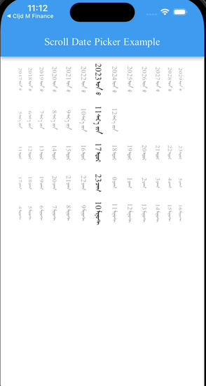

# mongol_date_picker

A Flutter date and time picker widget with Mongolian language support, built with ClojureDart.



## Features

- 🗓️ **Date Picker**: Select year, month, and day with vertical scrolling wheels
- ⏰ **Time Picker**: Select hour and minute
- 📅 **DateTime Picker**: Combined date and time picker with mode switching
- 🇲🇳 **Mongolian Language Support**: Full support for Mongolian text and numerals
- 🎨 **Customizable**: Configurable options for styling and behavior
- 📱 **Modal Bottom Sheet**: Easy-to-use modal picker dialog
- 🔄 **Smart Date Validation**: Automatically handles month-end dates (e.g., Feb 30 → Feb 28/29)

## Components

### `mongol-date-picker`
A date picker widget that displays year, month, and day in vertical scrolling wheels.

**Parameters:**
- `initial-date` (optional): Initial `DateTime` value
- `on-changed` (optional): Callback function that receives the selected `DateTime`
- `options` (optional): Custom styling and behavior options

### `mongol-time-picker`
A time picker widget that displays hour and minute in vertical scrolling wheels.

**Parameters:**
- `initial-date` (optional): Initial `DateTime` value (only hour and minute are used)
- `on-changed` (optional): Callback function that receives the selected `DateTime`
- `options` (optional): Custom styling and behavior options

### `mongol-datetime-picker`
A combined date and time picker with mode switching capability.

**Parameters:**
- `initial-date` (optional): Initial `DateTime` value
- `on-changed` (optional): Callback function that receives the selected `DateTime`
- `options` (optional): Custom styling and behavior options

### `show-picker`
Displays a modal bottom sheet with date/time picker.

**Parameters:**
- `ctx`: Build context
- `on-confirm`: Callback function that receives the confirmed `DateTime`
- `initial-date` (optional): Initial `DateTime` value
- `show-date` (optional, default: `true`): Whether to show date picker
- `show-time` (optional, default: `true`): Whether to show time picker
- `options` (optional): Custom styling and behavior options

## Configuration Options

The picker supports various customization options:

```clojure
{:item-extent 45.0           ; Height of each item in the wheel
 :diameter-ratio 1.3         ; Diameter ratio for the wheel
 :perspective 0.008          ; Perspective value for 3D effect
 :magnification 1.15         ; Magnification for selected item
 :use-haptics true           ; Enable haptic feedback on scroll
 :digit-type :arabic         ; :arabic or :mongol for number display
 :text-style TextStyle       ; Text styling for items
 :selected-color Color       ; Background color for selected item
 :item-height 80.0           ; Container height for each wheel
}
```

## Dependencies

- Flutter SDK
- [mongol](https://pub.dev/packages/mongol) package (^9.0.0) - For Mongolian text rendering
- ClojureDart - For Clojure-to-Dart compilation

## Getting Started

### Prerequisites

- Flutter SDK installed
- Clojure CLI tools installed
- ClojureDart setup

### Installation

1. Clone this repository
2. Add the package to your `pubspec.yaml` (if published) or use it as a local dependency

### Run Example

1. Install the clj command (if not already installed)
2. Initialize the example: `clj -M:cljd init`
3. Open a simulator: `open -a Simulator`
4. Run Flutter: `clj -M:cljd flutter`

## Usage Example

```clojure
(ns my-app.main
  (:require ["package:flutter/material.dart" :as m]
            [cljd.flutter :as f]
            [mongol-date-picker.picker :as picker]))

(defn main []
  (m/runApp
   (m/MaterialApp
    .home (f/widget
           :context ctx
           :managed [selected-date (atom nil)]
           (m/Scaffold
            .body (m/Center
                   .child (m/Column
                           .children
                           [(m/Text (if @selected-date
                                      (str "Selected: " @selected-date)
                                      "No date selected"))
                            (m/ElevatedButton
                             .onPressed (fn []
                                         (picker/show-picker ctx
                                                             (fn [date]
                                                               (reset! selected-date date))
                                                             :initial-date @selected-date))
                             .child (m/Text "Select Date & Time"))]))))))
```

## Year Range

The date picker supports a range of 200 years (100 years before and 100 years after the initial date).

## License

MIT License

## Resources

- [Flutter Documentation](https://docs.flutter.dev/)
- [ClojureDart](https://github.com/tensegritics/ClojureDart)
- [Mongol Package](https://pub.dev/packages/mongol)